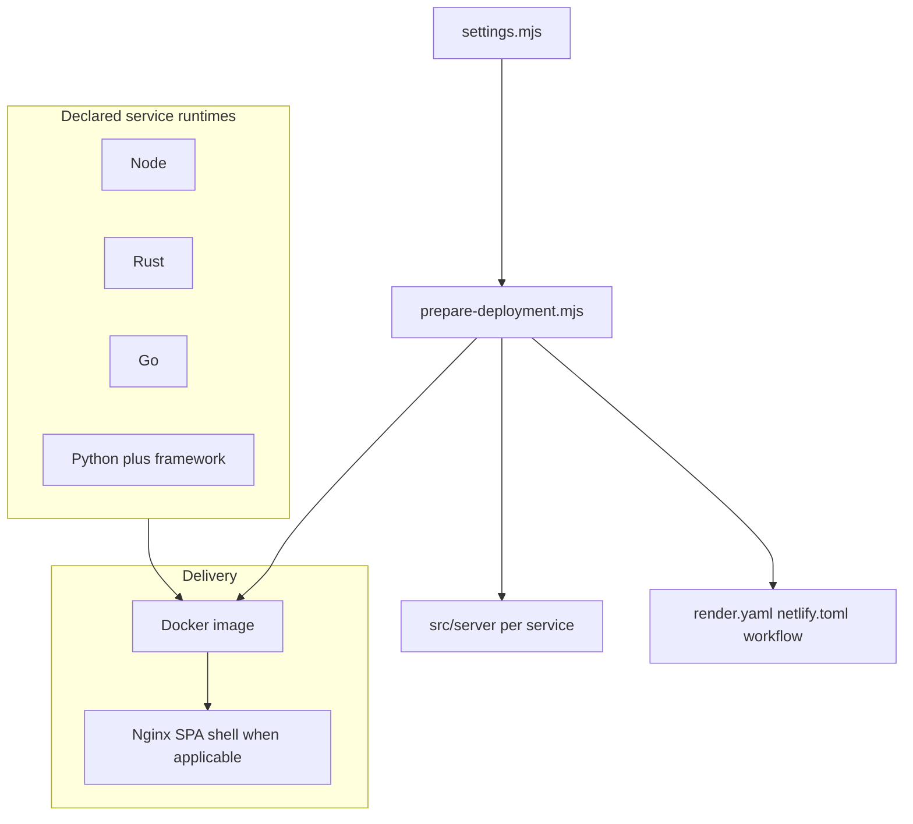
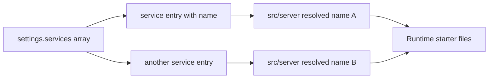
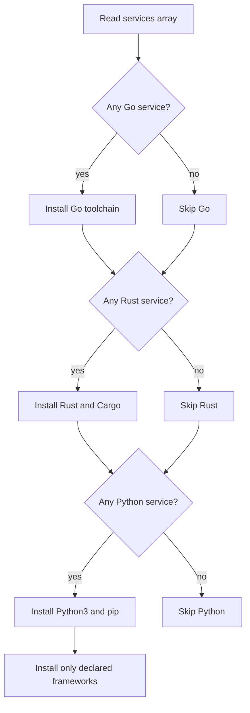

# Deployment system guide

Settings-driven deployment: one source of truth for **host**, **service type**, and **endpoint services**, with validated scaffolds and conditional Docker installs.

**Centerpieces**

- Typed settings: [src/deployment/types/settings.ts](types/settings.ts), [src/deployment/settings/settings.mjs](settings/settings.mjs), [src/deployment/settings/settings.ts](settings/settings.ts)
- [src/deployment/scripts/prepare-deployment.mjs](scripts/prepare-deployment.mjs) — validate, scaffold `src/server/<name>/`, emit host files
- [src/deployment/scripts/runtime-install-plan.mjs](scripts/runtime-install-plan.mjs) — flags consumed by the Dockerfile
- [vite.config.ts](../../vite.config.ts) — `base` for GitHub Pages static, dev `proxy` to `localPort` services

---

## Stack overview (conceptual)

Runtimes you can declare today: **Node**, **Rust**, **Go**, **Python** (with `flask` | `falcon` | `bottle`). Images below are descriptive only (no binary assets required in-repo).



---

## Directory layout

| Path | Role |
| ---- | ---- |
| `src/deployment/types/settings.ts` | Type definitions for settings |
| `src/deployment/settings/settings.mjs` | Authoritative JS settings (imported by Node scripts and re-export patterns) |
| `src/deployment/settings/settings.ts` | Typed surface for `vite.config.ts` |
| `src/deployment/scripts/prepare-deployment.mjs` | Prepare / scaffold / host artifacts |
| `src/deployment/scripts/runtime-install-plan.mjs` | Prints install flags for Docker |
| `src/server/<service-name>/` | One folder per `services[]` entry |

---

## Core model

| Field | Values |
| ----- | ------ |
| `host` | `github.io`, `netlify`, `render.com` |
| `type` | `web-service` or `static` |
| `services` | Endpoint services with `name`, `type` (`node` \| `rust` \| `go` \| `python`), optional `routePrefix`, optional `localPort` |

**Host vs type (enforced in types + prepare script)**

- `github.io` → **static** only
- `netlify` → **static** only
- `render.com` → **static** or **web-service**

**Python** services must set `pythonFramework` (`flask` \| `falcon` \| `bottle`); non-Python services must not.

---

## Settings and example shape

- Primary: `src/deployment/settings/settings.mjs`
- Typed companion: `src/deployment/settings/settings.ts`

Example:

```yaml
# conceptual — actual file is JS module exporting an object
host: render.com
type: web-service
services:
  - name: api
    type: node
    routePrefix: /api
    localPort: 8787
```

---

## Service-to-folder mapping

Each `services[]` entry maps to **`src/server/<name>/`**. Declaring `api` and `users` yields `src/server/api` and `src/server/users`. The prepare script adds runtime-specific starter files.



---

## Scaffolding by runtime

| Runtime | Created artifacts (typical) |
| ------- | --------------------------- |
| Node | `index.ts` with a **healthcheck** export |
| Rust | `Cargo.toml`, `src/main.rs` |
| Go | `go.mod`, `main.go` |
| Python | `requirements.txt`, `app.py` template for chosen framework |

---

## Conditional runtime installation

Docker installs only what `settings.services` needs.

1. `runtime-install-plan.mjs` reads `services`.
2. It emits shell flags: `NEED_GO`, `NEED_RUST`, `NEED_PYTHON`, `PYTHON_FRAMEWORKS`.
3. The Dockerfile branches on those flags.
4. Python installs only declared framework packages.



---

## Host artifact generation

| Host / type | Output (via prepare) |
| ----------- | --------------------- |
| Render web-service | Updates `render.yaml`, Docker-oriented defaults |
| Render static | Static-site style in `render.yaml` |
| Netlify static | `netlify.toml` with SPA fallback and optional chat redirect |
| GitHub Pages static | `.github/workflows/deploy-github-pages.yml` (`static.githubPages.deployBranch`, default `gh-deploy`) |

---

## Chat proxy (Chat Slayer)

When chat is enabled with `"serviceUrl": "/chat-api"` in [`chat/config.json`](../../src/client/public/chat/config.json), the browser calls a **same-origin path**; each host materializes a reverse proxy to Chat Slayer. Player-facing config and CORS are documented in [CHAT.md](../../CHAT.md).

### Three layers

| Layer | Source | Purpose |
| ----- | ------ | ------- |
| 1 — Shared default | [`chat-proxy.defaults.mjs`](chat-proxy.defaults.mjs) | `DEFAULT_CHAT_PROXY_PREFIX` (`/chat-api`) and `DEFAULT_CHAT_UPSTREAM_URL` (default Chat Slayer origin) |
| 2 — Host adapter | Optional `chat` in `settings.mjs` | `mode` (`same-origin-proxy` \| `direct`), `materializer` — inferred from `host` when omitted |
| 3 — Env override | `CHAT_UPSTREAM_URL` | Override upstream at Render container start or Netlify/build CI (https origin only) |

**Inferred defaults when `chat` is omitted:**

| Host | `mode` | `materializer` |
| ---- | ------ | -------------- |
| `github.io` | `direct` | `none` (client uses build-time direct URL on `*.github.io`) |
| `netlify` | `same-origin-proxy` | `netlify-redirect` |
| `render.com` web-service | `same-origin-proxy` | `nginx` |

Optional explicit shape in `settings.mjs`:

```js
chat: {
  mode: 'same-origin-proxy',
  materializer: 'netlify-redirect',
  proxyPrefix: '/chat-api',
  upstreamUrl: 'https://chat-slayer.onrender.com' // optional; defaults from chat-proxy.defaults.mjs
}
```

When `mode` is `same-origin-proxy`, prepare validates that `chat/config.json` `serviceUrl` matches `proxyPrefix`.

### What `npm run deploy:prepare` generates

- **`deploy/chat-proxy.env.defaults`** — nginx defaults (`CHAT_UPSTREAM_URL`, `CHAT_PROXY_PREFIX`, `CHAT_PROXY_HOST`)
- **Netlify** — `/chat-api/*` redirect in `netlify.toml` (before SPA fallback)
- **Render Docker** — template at [`templates/nginx.chat-proxy.conf.template`](templates/nginx.chat-proxy.conf.template); [`docker-entrypoint.sh`](../../docker-entrypoint.sh) runs `envsubst` at container start into `/etc/nginx/snippets/chat-proxy.conf` (included from [`nginx.conf`](../../nginx.conf); not under `conf.d/` so nginx does not load `location` at http context)
- **Vite** — dev proxy and build-time `__CHAT_PROXY_PREFIX__` / `__CHAT_DIRECT_UPSTREAM_URL__` defines ([`vite.config.ts`](../../vite.config.ts))

Do **not** hand-edit nginx chat location blocks or Netlify redirect targets — run `npm run deploy:prepare` on the deploy branch and commit the generated files.

---

## Vite integration

[vite.config.ts](../../vite.config.ts) imports deployment settings for:

- **`base`** when `host` is `github.io` and `type` is `static`
- **Dev proxy** map: `routePrefix` → `http://localhost:<localPort>` for services that define `localPort`
- **Chat dev proxy** — `/chat-api` → resolved upstream when `chat.mode` is `same-origin-proxy`
- **Social meta tags** — `static.publicUrl` (and branding `social.siteUrl` fallback) for absolute Open Graph / Twitter URLs in `index.html`; see [BRANDING.md — Social link previews](../../BRANDING.md#social-link-previews)

---

## Default profile

Defaults target **Render** **web-service**: Docker + Nginx-style SPA serving, `PORT` aligned with Render conventions (see generated `render.yaml` after prepare).

---

## Typical workflow

1. Edit `src/deployment/settings/settings.mjs`.
2. Run `npm run deploy:prepare`.
3. Review `src/server/*` and generated host files.
4. Run `npm run dev` and hit proxied API routes locally.
5. Deploy to the chosen host.

### Feature tag sync to main and deployment branches

Feature work can be prepared for **`main`** and every deployment branch by pushing a `feature/**` tag at the
commit to promote:

```bash
git tag feature/my-feature
git push origin feature/my-feature
```

The **Sync feature ref to main and deployment branches** workflow (file: `sync-feature-tag-to-deploy-branches.yml`) opens reviewable PRs into:

- `main` — normal merge of the feature commit (deployment settings from the feature are **not** stripped; no `merge=ours` preservation step).
- `render-deploy`
- `netlify-deployment`
- `gh-deploy`

For each **deployment** branch, each PR is prepared from the target branch, merges the tagged feature commit, then
restores the target branch's deployment identity files before validation:

- `src/deployment/settings/settings.mjs`
- `src/deployment/settings/settings.mjs.d.ts`
- `src/deployment/settings/settings.d.mts`

Those files are branch-owned on deployment branches. Feature branches should not rely on a tag sync to change a deployment
branch's host/type settings; update the deployment branch settings intentionally when that is the
actual goal. The PR into **`main`** does **not** use that preservation step.

The workflow runs `npm ci`, `npm run export:playground`, `npm run typecheck`, `npm run lint`, and
`npm run format:check` before creating or updating each sync PR. Merge conflicts outside the
preserved settings files (on deployment targets) fail the affected matrix job and should be resolved manually.

### Static host quick notes

- **github.io** — `host: github.io`, `type: static`, set `static.basePath`, optional `static.publicUrl` and `static.githubPages`, run `npm run deploy:prepare`, commit workflow. **Forks:** [FORK_GITHUB_SETUP.md](../../FORK_GITHUB_SETUP.md). **Pages:** [GITHUB_PAGES_STATIC_SITE_DEPLOYMENT.md](../../GITHUB_PAGES_STATIC_SITE_DEPLOYMENT.md). **Social previews:** [BRANDING.md — Social link previews](../../BRANDING.md#social-link-previews).
- **netlify** — `host: netlify`, `type: static`, prepare, commit `netlify.toml`. Include any backend services (e.g. the Go multiplayer server) in `services[]` with a `localPort` so the Vite dev proxy routes local API calls correctly. `localPort` is ignored by Netlify at deploy time — it only activates the dev proxy. Set `static.publicUrl` on **`netlify-deployment`** for link previews ([BRANDING.md](../../BRANDING.md#social-link-previews)).
- **render static** — `host: render.com`, `type: static`, prepare.
- **render web-service** — set `static.publicUrl` on **`render-deploy`** when shipping the SPA from Render ([BRANDING.md](../../BRANDING.md#social-link-previews)).

**Netlify + local multiplayer example** (`settings.mjs`):

```js
const deploymentSettings = {
  host: 'netlify',
  type: 'static',
  services: [
    {
      name: 'multiplayer',
      type: 'go',
      routePrefix: '/api/multiplayer',
      localPort: 5000
    }
  ],
  static: {
    basePath: '/',
    publicUrl: 'https://your-site.netlify.app'
  }
};
```

With this config, `npm run dev` proxies `/api/multiplayer/*` → `localhost:5000` so `npm run dev:multiplayer` (the Go server) is reachable from the browser. Omitting the service entry (leaving `services: []`) causes every multiplayer API call to 404 in local dev.

---

## Validation (prepare)

- Valid `host` / `type` pairs
- Unique service `name` values
- `routePrefix` shape
- `localPort` integer when provided
- `pythonFramework` required for Python, forbidden otherwise

---

## Troubleshooting

| Symptom | Check |
| ------- | ----- |
| Missing `src/server/<name>` | Non-empty unique `name`; prepare exited 0 |
| Extra languages in Docker image | Current `services` list; run `node src/deployment/scripts/runtime-install-plan.mjs` |
| Missing Netlify / Pages files | `host` and `type` in `settings.mjs`; re-run `npm run deploy:prepare` |
| Chat `/chat-api` 404 on Netlify or Render | Run `npm run deploy:prepare` on the deploy branch; commit generated `netlify.toml` or redeploy Docker with updated `deploy/chat-proxy.env.defaults` |
| Wrong Chat Slayer upstream in production | Set `CHAT_UPSTREAM_URL` (https origin) on Render or Netlify build env; re-run prepare locally if needed |

---

## Future enhancements

- Multi-service port helpers
- Non-Docker buildpack presets
- Service env / secrets schema
- Typed client stubs from OpenAPI or similar
